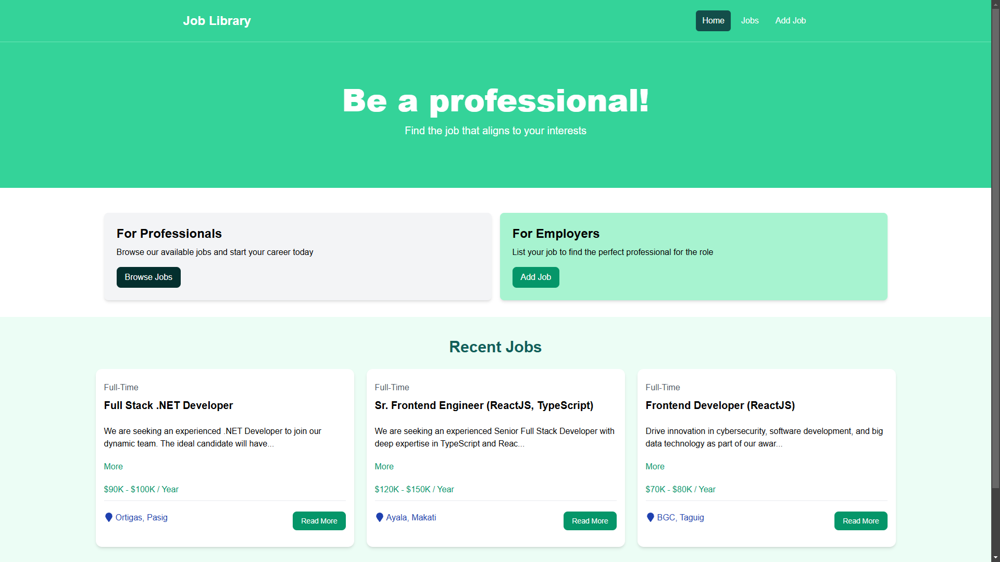
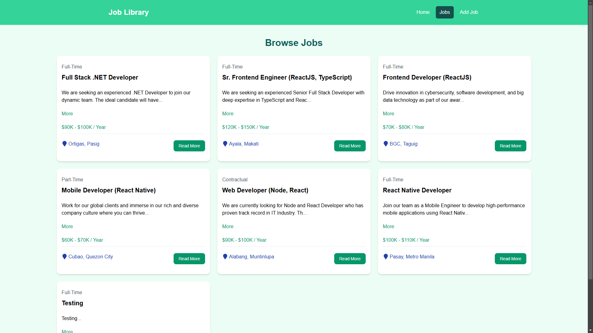
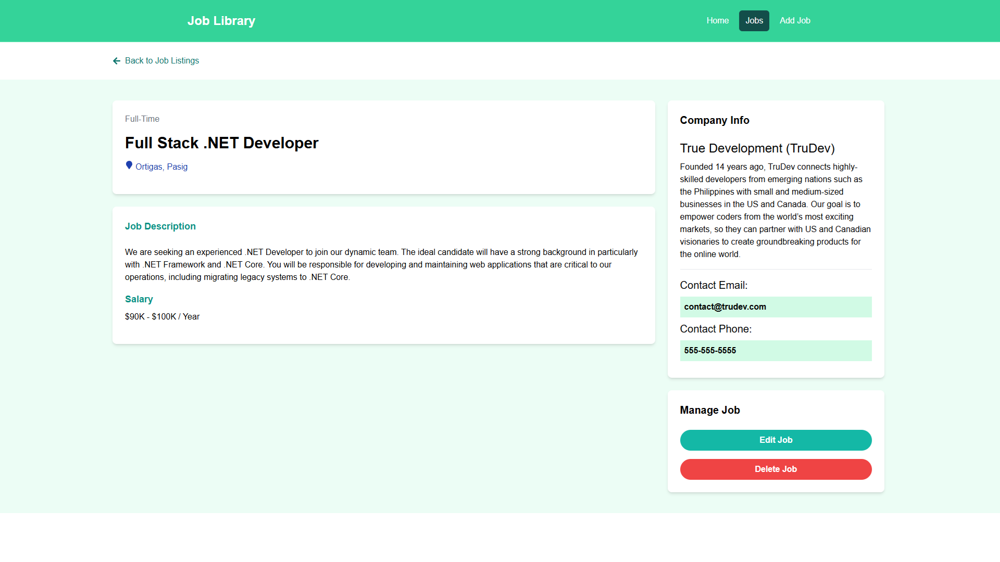
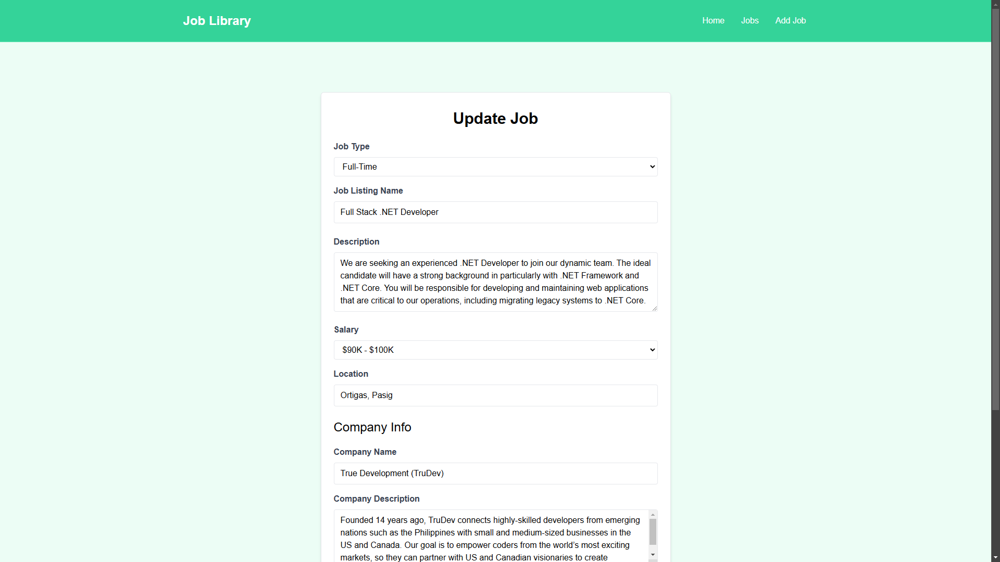
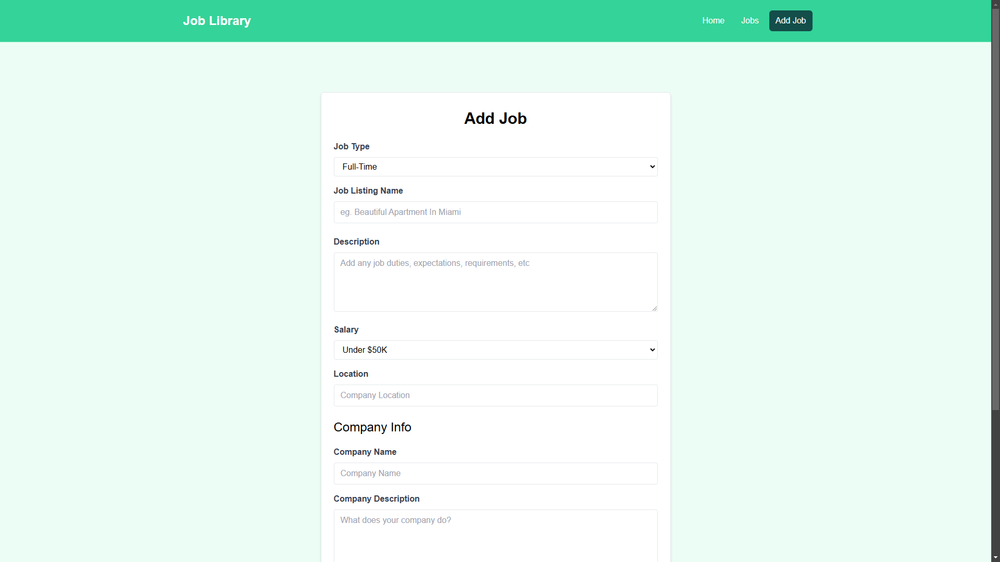

# Job Library - Job Listing Web App

A ReactJS project included in [Traversy Media React Crash Course 2024](https://www.youtube.com/watch?v=LDB4uaJ87e0). A course I took as a refresher.

## ⚙️ Tech Stack
- React Native
- TailWind

## 🤖 Features
- CRUD functionalities for job listings
- Consists of 5 pages (Home, Add Job, Jobs, Job, Edit Job)

## 🚀 Quick start

Follow these steps to set up the project locally on your machine.

**Prerequisites**

Make sure you have the following installed on your machine:

- [Git](https://git-scm.com/)
- [Node.js](https://nodejs.org/en)
- [npm](https://www.npmjs.com/) (Node Package Manager)

**Clone the repository and open in your IDE**

```bash
git clone https://github.com/dfranzzzzz/Job-Library.git
```

**Installation**

Install the project dependencies using npm:

```bash
npm install
```

**Running the server (This project uses JSON Server for mock backend)**

```bash
npm run server
```

**Running Vite to run the project**
```bash
npm run dev
```

## 📸 Screenshots

<p>
  
  
  
  
  
</p>
